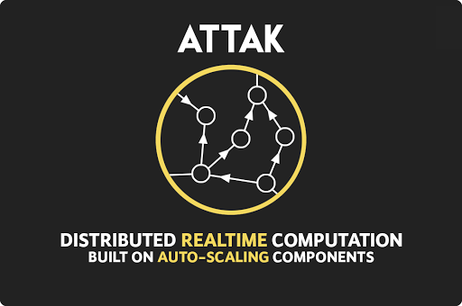

[](http://attak.io)

## Serverless done right

ATTAK is a full-stack framework for applications built on auto-scaling components.

We aim to be platform agnostic, beginning with support for Amazon Web Services and then Google Cloud.

### Why use ATTAK

Companies like Amazon and Google create amazing building blocks, but they don't put much focus on tools. ATTAK blends many services together to create a fully featured application framework, and offers tools for local simulation, unit testing, and much more. It handles the setup for permissions, event triggers, etc., and lets you focus on your application rather than platform specifics.

### Status

Pre-alpha.

Roadmap:

- Alpha release on AWS expected summer 2017
- Alpha Google compatibility late 2017

Readme and other documentation may be inaccurate or incomplete.

# Contents

* [Quick Start](#quick-start)
* [Examples](#examples)
* [Topologies](#topologies)
  * [Processor Definitions](#processor-definitions)
  * [Stream Definitions](#stream-definitions)
* [Processors](#processors)
  * [Handler Functions](#handler-functions)
  * [Emitting Data](#emitting-data)
  * [Handler Callback](#handler-callback)
* [Streams](#streams)
  * [Static Definitions](#processor-definitions)
  * [Dynamic Definitions](#stream-definitions)
* [Schedule](#schedule)
* [Static](#static)

# Quick Start

## Install cli

`npm install -g attak`

## Create an attak topology

Generate a simple boilerplate project by running:

`attak init`

## Setup environment

Rename `.env.example` to `.env` and put in values as appropriate for your deploy. The required fields are:

- `AWS_ACCESS_KEY_ID`
- `AWS_SECRET_ACCESS_KEY`
- `AWS_ROLE_ARN`

## Topology simulation and debugging

Visit [the ATTAK ui](http://attak.io#local) and run the simulation with the command displayed, which will look like:

`attak simulate -i [simulation id]`

If you want to run the topology without the UI debugger, simply run

`attak simulate`

## Deploy the topology

ATTAK will deploy all processors and streams in the topology.

```attak deploy```

# Examples

## Basic functionality demos
- [Simple hello world](http://github.com/attak/attak-hello-world) - Emit some text and reverse it
- [HTTP Endpoint](https://github.com/attak/attak-examples/tree/master/http-endpoint) - Basic request handler
- [Scheduled Events](https://github.com/attak/attak-examples/tree/master/scheduled) - Trigger functions on a schedule
- [Dynamic processor/stream definitions](https://github.com/attak/attak-examples/tree/master/processor-ring) - Example of dynamic definitions

## Complex examples
- [Chat Room](https://github.com/attak/attak-chat) - Chat room with google auth
- [Stream github events](http://github.com/attak/attak-github-events) - Monitor the GitHub Events API for updates and process the results

# Topologies

An topology is a structure that defines the features of your application. It declares the resources required (serverless functions, message queues, static hosting, authentication, etc.) and ATTAK will automatically setup the permissions and connections necessary.

> Note: An ATTAK project is meant to be a node package, so we will `require` the project directory, and `index.js` (or whatever is specified in `package.json` as `main`) will be loaded as your topology.

Every topology needs a name, but all other parameters are optional. They include:

- [`processors`](#processors) - event handler functions
- [`schedule`](#schedule) - trigger processors periodically
- [`streams`](#streams) - connections between processors
- [`static`](#static) - static hosting configuration
- [`api`](#api) - handle HTTP requests

At its core, a topology is a description of one or more processors and the connections between them. Here's an example of a very simple topology. Processors is a key-value map between processor name and procesor definition, and streams is an array of processor connections.

```js
module.exports = {
  name: 'attak-example',
  processors: {
    reverse: './processors/reverse',
    hello_world_spout: './processors/hello_world'
  },
  streams: [
    ['hello_world_spout', 'reverse']
  ]
}
```

ATTAK can build many different types of applications. For instance, here's a topology that sets up static hosting and an HTTP endpoint, but no streams.

```js
module.exports = {
  name: 'static-example',
  static: './public',
  api: 'requestHandler',
  processors: {
    requestHandler: function(event, context, callback) {
      callback(null, "Amazing HTTP request response")
    }
  }
}
```

# Processors

Processors are the basic unit of computation in ATTAK and can be thought of as analygous to a single serverless function. A processor has a main "handler function" that is called in response to events, and it can be used to process data, emit events, invoke other processors, call other handler functions directly, or otherwise run code on command.

## Handler functions

Handler functions are called with an event, context, and callback like other serverless frameworks. Unlike other frameworks, ATTAK handlers have `context.emit(topic, message)`, which allows them to send out data across the topology. They may emit any number of events, and must call the callback when finished. Here's an example handler:

```js
module.exports = {
  handler: function(event, context, callback) {
    console.log(event)
    context.emit('output topic', 'hello ' + event.name)
    callback()
  }
}
```

## Emitting events

Processors can emit any number of events on any number of [topics](#topics). Events can optionally contain data of any type.

```js
handler: function(event, context, callback) {
  context.emit('processing started')
  context.emit('got event', event)

  // If emitting a lot, do it asynchronously
  context.emit('frequent', 'event', function(err) {
    console.log('done emitting')

    // The handler must call the callback. We can emit
    // errors if we have them
    if (err) {
      callback(err)
    } else {
      callback()
    }
  })
}
```

## Inline handlers

Processor handler functions can be defined inline

```js
module.exports = {
  processors: {
    inlineProcessor: function(event, context, callback) {
      // process the event...
      event.total += 1
      context.emit('topic name', {your: 'data'})
      callback()
    }
  }
}
```

## Processor folders

If all processors are in a single folder, processors can be set to the folder path.

```js
module.exports = {
  processors: './processors'
}
```

## Dynamic definitions

If we want to dynamically generate processors, we have two options.

We can define a function that will return an key-value map of processor name to processor definitions:

```js
module.exports = {
  processors: function() {
    var processors = []
    
    for (var iProcessor=0; iProcessor<10; ++iProcessor) {
      processors.push(
        function(event, context, callback) {
          ...your processor logic...
        }
      )
    }

    return processors
  }
}
```

Or we can define a function that takes a processor name and returns processor definitions:

```js
module.exports = {
  processor: function(name) {
    return function(event, context, callback) {
        ...your processor logic...
    }
  }
}
```

## Handler callback

The processor's callback argument is important for several reasons

**It signals the end of asynchronous execution**

Serverless functions (which processors run on) are billed by the millisecond. Calling the callback shuts down process execution, which also shuts down billing.

_Note: Emitting data is an asynchronous operation and takes some time. If a processor emits data and then immediately calls the callback, process execution will not halt until all emits are complete._

**It allows the handler function to report errors without crashing.**

Callbacks are one way to report errors. Error handling is an important topic, so it has it's [own section](#error-handling).

## Logs

Processor logs are recorded and stored according to the platform being used. For example, AWS Lambda logs can be found in AWS CloudWatch.

More logging featrues and details coming soon.

## Error handling

Debugging issues on a distributed topology is difficult. When a processor has an error we want to figure out what the stack/context/event data were, and we may even want to know the states of other previous processors.

ATTAK has a built in error handling system. Errors are recorded, retries are configurable, 

By default, errors are not replayed, but rather recorded into an errors queue. By default the queue lasts for 24 hours, but can be configured to persist into DynamoDB or other datastores.

**reported errors**

The [handler callback](#handler-callback) can be called with an error as the first parameter to report an error.

```js
handler: (event, context, callback) {
  try {
    throw new Error 'purposefully caused error'
  } catch(err) {
    callback(err)
  }
}
```

This will allow ATTAK to record the error and stop execution as fast as possible. Emits that were still processing before the error will be allowed to finish.


# Streams

Streams setup the flow of data between processors. Behind the scenes, a stream configures ATTAK to send emitted data through a distributed queue (Kinesis Streams, for example) to another processor.

## Static definitions

Since streams are simply connections between two processors, they can be defined very simply as an array

```js
streams: [
  // Simple stream from source to destination
  ['sourceProcessor', 'destProcessor'],

  // There can be unlimited streams from a given processor
  ['sourceProcessor', 'otherProcessor'],

  // There can also be unlimited streams into a given processor
  ['otherProcessor', 'finalProcessor'],
 
  // Loops are fine too
  ['finalProcessor', 'sourceProcessor'],

  // Listen for events on a specific topic
  ['finalProcessor', 'otherProcessor', 'finalProcessorTopic'],
]
```

Streams can also be defined as an object structure, which allows for more options to be defined:

```js
module.exports = {
  name: 'stream-example'
  streams: [
    {
      from: 'processor1',
      to: 'processor2',
      shards: 50
    }
  ]
}
```

## Dynamic definitions

Streams can be defined dynamically by providing a function for your topology's `streams` parameter. The function is called as the topology is loaded, and should return an array of stream definitions (in either array or object format)

```js
  streams: function() {
    var streams = []

    for (var iStream=0; iStream<NUM_PROCESSORS; ++iStream) {
      streams.push({
        to: `processor${iStream}`,
        from: `processor${iStream == NUM_PROCESSORS - 1 ? 0 : iStream + 1}`
      })
    }

    return streams
  }
```

# Schedule

ATTAK can trigger processors on a schedule. Schedules can be define in cron-like pattens or by specifying a call frequency.

```js
  module.exports = {
    name: 'scheduled',
    schedule: [
      {
        name: 'every_2_minutes_cron',
        type: 'cron',
        value: '*/2 * * * ? *',
        processor: 'onEvent'
      },
      {
        name: 'every_minute_rate',
        type: 'rate',
        value: '1 minute',
        processor: 'onEvent'
      }
      {
        name: 'twice_a_day_rate',
        type: 'rate',
        value: '12 hours',
        processor: 'onEvent'
      }
    ],
    processors: {
      onEvent: function(event, context, callback) {
        console.log("INSIDE SCHEDULED EVENT HANDLER", event)
        callback(null, {ok: true})
      }
    }
  }
```

# Static

ATTAK can configure your files to be hosted statically on services like s3. It will also assist with setting up things like federated authentication (sending users through a google authentication flow for AWS Cognito credentials, for instance).

## Directory hosting

Setting up basic static hosting is easy:

```js
  module.exports = {
    // Uploads all files in public and makes them publicly viewable
    static: './public'
  }
```

## Authentication

This feature is under active development, but an example looks something like:

```js
  static: {
    // Expose files inside the build directory
    dir: './build',
    permissions: {
      // Setup permissions for the front end to invoke processor1
      invoke: ['processor1']
    },
    auth: {
      federated: {
        // Setup a federated google auth flow using an api key
        google: {
          key: '...'
        }
      }
    }
  },
```